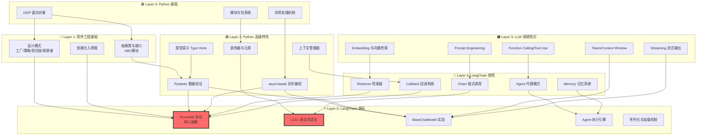

# LangChain 源码学习路线图

## 1. 前置知识清单（地基检查）

```
┌─────────────────────────────────────────────────────────────────────┐
│                        🏗️ 前置知识地基                              │
├─────────────────────────────────────────────────────────────────────┤
│                                                                     │
│  Layer 4 │ LangChain 使用经验 │ 用过API、写过Chain/Agent          │
│  ────────┼───────────────────────────────────────────────────────   │
│  Layer 3 │ LLM 领域知识      │ Prompt/Embedding/Token/RAG概念     │
│  ────────┼───────────────────────────────────────────────────────   │
│  Layer 2 │ Python 高级特性   │ 异步/类型提示/元类/装饰器/Pydantic │
│  ────────┼───────────────────────────────────────────────────────   │
│  Layer 1 │ 软件工程基础      │ 设计模式/抽象类/依赖注入           │
│  ────────┼───────────────────────────────────────────────────────   │
│  Layer 0 │ Python 基础       │ OOP/模块系统/异常处理              │
│                                                                     │
└─────────────────────────────────────────────────────────────────────┘
```

---

## 2. 学习路径依赖图



---

## 3. 每层的 20% 核心知识（产生 80% 效果）

### 📊 核心知识矩阵

| Layer | 核心 20% | 80% 可跳过 |
|-------|---------|-----------|
| **Python 高级** | Pydantic BaseModel、async/await、TypeVar+Generic | 元类深度、描述器协议、GIL细节 |
| **设计模式** | 模板方法、策略模式、责任链 | 单例、建造者、访问者等 |
| **LLM 概念** | Prompt模板、Embedding原理、Streaming | 模型训练细节、Tokenizer实现 |
| **LangChain 使用** | Runnable接口、Chain组合、Callback | 所有Loader、所有VectorStore实现 |
| **源码阅读** | langchain-core 核心包 | langchain-community 具体实现 |

---

## 3.1 原子化问题清单

### 🔷 Layer 2: Python 高级特性

```yaml
Pydantic:
  - Q1: "BaseModel 的 __init__ 是如何自动从类型注解生成的？"
  - Q2: "Field() 中的 default_factory 与 default 有什么区别？"
  - Q3: "model_validator 装饰器在什么时机被调用？"
  - Q4: "@property 与 Pydantic 的 computed_field 有何不同？"
  - Q5: "如何自定义一个 Pydantic 字段的序列化逻辑？"

异步编程:
  - Q1: "await 一个 coroutine 时，事件循环做了什么？"
  - Q2: "asyncio.gather 和 asyncio.wait 的区别是什么？"
  - Q3: "为什么不能在同步函数中直接 await？"
  - Q4: "async for 是如何实现的？需要什么协议？"
  - Q5: "run_in_executor 何时使用？解决什么问题？"

类型系统:
  - Q1: "TypeVar 的 bound 参数有什么作用？"
  - Q2: "Generic[T] 是如何让类支持泛型的？"
  - Q3: "Callable[[int], str] 这个类型表示什么？"
  - Q4: "Protocol 类与 ABC 有何区别？"
  - Q5: "get_type_hints() 函数返回什么？"
```

### 🔷 Layer 1: 设计模式

```yaml
模板方法:
  - Q1: "抽象方法和钩子方法的区别是什么？"
  - Q2: "为什么 LangChain 的 _call 是抽象的而 invoke 不是？"
  - Q3: "如何用模板方法实现'开闭原则'？"

策略模式:
  - Q1: "策略模式如何消除大量 if-else？"
  - Q2: "LangChain 的不同 LLM 实现是策略模式吗？"

责任链:
  - Q1: "责任链中一个节点如何决定继续或终止？"
  - Q2: "Chain 的 | 操作符是如何组合责任链的？"
```

### 🔷 Layer 3: LLM 领域知识

```yaml
Prompt:
  - Q1: "ChatPromptTemplate 中 {variable} 如何被替换？"
  - Q2: "System/Human/AI message 的角色有什么语义区别？"
  - Q3: "few-shot prompt 为什么有效？"

Embedding:
  - Q1: "Embedding 向量的维度意味着什么？"
  - Q2: "余弦相似度为什么比欧氏距离更常用？"
  - Q3: "为什么需要 chunk 切分长文档？"

Streaming:
  - Q1: "流式输出时 token 是如何一个个传递的？"
  - Q2: "SSE (Server-Sent Events) 协议是如何工作的？"
```

### 🔷 Layer 5: LangChain 源码核心

```yaml
Runnable 协议:
  - Q1: "Runnable 接口定义了哪些核心方法？"
  - Q2: "invoke/ainvoke/batch/stream 四者关系是什么？"
  - Q3: "RunnableSequence 是如何实现 | 操作符的？"
  - Q4: "RunnableParallel 如何收集多个分支的输出？"
  - Q5: "bind() 方法的作用是什么？返回什么？"

LCEL:
  - Q1: "chain = prompt | llm | parser 这行代码创建了什么对象？"
  - Q2: "__or__ 方法是如何被重载的？"
  - Q3: "RunnableLambda 如何把普通函数变成 Runnable？"

BaseChatModel:
  - Q1: "generate() 和 invoke() 的关系是什么？"
  - Q2: "_generate() 抽象方法的签名是什么？"
  - Q3: "streaming 是如何通过 callback 实现的？"
```

---

## 3.2 可跳过的 80% 枝节

```
┌─────────────────────────────────────────────────────────────────────┐
│                     🚫 可跳过/延后学习的内容                         │
├─────────────────────────────────────────────────────────────────────┤
│                                                                     │
│  langchain-community 包                                             │
│  ├── 具体的 100+ 种 DocumentLoader 实现                            │
│  ├── 具体的 50+ 种 VectorStore 适配器                              │
│  ├── 具体的 30+ 种 LLM 提供商实现（看 1-2 个即可）                  │
│  └── 具体的工具 (Tools) 实现细节                                   │
│                                                                     │
│  langchain 包的边缘模块                                             │
│  ├── 遗留的 LLMChain / SequentialChain（已废弃）                   │
│  ├── 实验性功能 (experimental)                                     │
│  └── 特定领域的 agents (SQL/CSV/JSON agent)                        │
│                                                                     │
│  LangSmith / LangServe 集成                                        │
│  ├── 追踪与监控实现细节                                            │
│  └── 部署相关代码                                                  │
│                                                                     │
│  深度实现细节                                                       │
│  ├── 缓存系统的多种后端实现                                        │
│  ├── 序列化的完整兼容性处理                                        │
│  └── 多语言绑定 (langchain.js 对应逻辑)                            │
│                                                                     │
└─────────────────────────────────────────────────────────────────────┘
```

---

## 🎯 推荐源码阅读顺序

```mermaid
flowchart LR
    subgraph Phase1["Phase 1: 核心协议"]
        A[langchain_core/runnables/base.py<br/>Runnable 抽象基类] 
        B[langchain_core/runnables/chain.py<br/>RunnableSequence]
    end
  
    subgraph Phase2["Phase 2: 消息系统"]
        C[langchain_core/messages/base.py]
        D[langchain_core/prompts/chat.py]
    end
  
    subgraph Phase3["Phase 3: 模型抽象"]
        E[langchain_core/language_models/chat_models.py<br/>BaseChatModel]
        F[langchain_openai/chat_models/base.py<br/>具体实现参考]
    end
  
    subgraph Phase4["Phase 4: 回调系统"]
        G[langchain_core/callbacks/manager.py]
        H[langchain_core/tracers/base.py]
    end
  
    A --> B --> C --> D --> E --> F --> G --> H
```



---

## 📁 关键文件一览

```bash
langchain-core/                    # ⭐ 最重要，必读
├── langchain_core/
│   ├── runnables/
│   │   ├── base.py               # ★★★★★ Runnable 核心
│   │   ├── chain.py              # ★★★★★ Sequence/Parallel
│   │   ├── passthrough.py        # ★★★☆☆ RunnablePassthrough
│   │   └── router.py             # ★★★☆☆ 路由逻辑
│   ├── language_models/
│   │   ├── base.py               # ★★★★☆ 语言模型基类
│   │   └── chat_models.py        # ★★★★★ Chat 模型核心
│   ├── prompts/
│   │   ├── base.py               # ★★★★☆ Prompt 基类
│   │   └── chat.py               # ★★★★☆ ChatPrompt
│   ├── output_parsers/
│   │   └── base.py               # ★★★☆☆ 输出解析器
│   └── callbacks/
│       └── manager.py            # ★★★★☆ 回调管理

langchain/                         # 组合层
├── chains/                        # 可以跳过(遗留)
└── agents/
    └── agent.py                  # ★★★★☆ Agent 执行器
```

需要我深入展开任何一个部分吗？例如：
- 某个原子问题的详细解答
- 某个源码文件的逐行解读
- 某个设计模式在 LangChain 中的具体应用